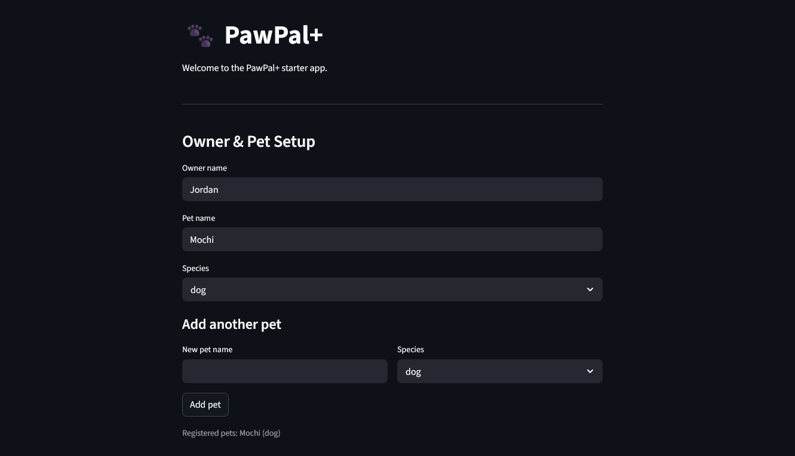
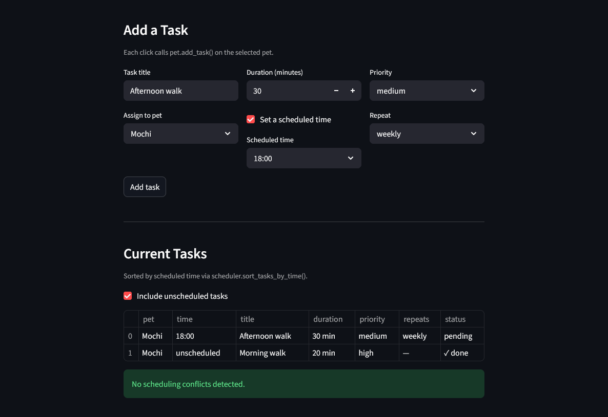
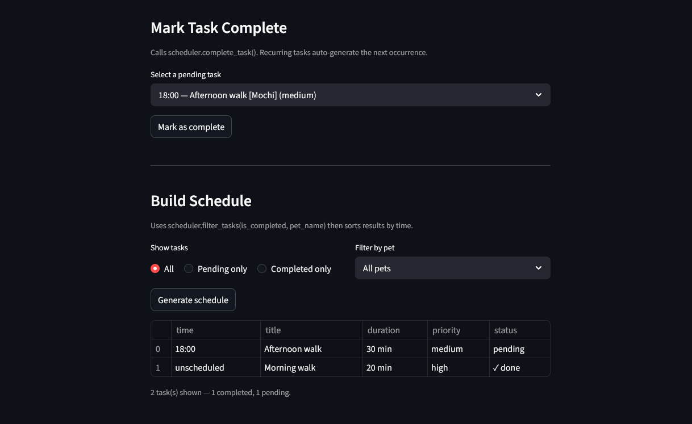

# PawPal+ (Module 2 Project)

You are building **PawPal+**, a Streamlit app that helps a pet owner plan care tasks for their pet.

## Scenario

A busy pet owner needs help staying consistent with pet care. They want an assistant that can:

- Track pet care tasks (walks, feeding, meds, enrichment, grooming, etc.)
- Consider constraints (time available, priority, owner preferences)
- Produce a daily plan and explain why it chose that plan

Your job is to design the system first (UML), then implement the logic in Python, then connect it to the Streamlit UI.

## What you will build

Your final app should:

- Let a user enter basic owner + pet info
- Let a user add/edit tasks (duration + priority at minimum)
- Generate a daily schedule/plan based on constraints and priorities
- Display the plan clearly (and ideally explain the reasoning)
- Include tests for the most important scheduling behaviors

## Getting started

### Setup

```bash
python -m venv .venv
source .venv/bin/activate  # Windows: .venv\Scripts\activate
pip install -r requirements.txt
```

### Suggested workflow

1. Read the scenario carefully and identify requirements and edge cases.
2. Draft a UML diagram (classes, attributes, methods, relationships).
3. Convert UML into Python class stubs (no logic yet).
4. Implement scheduling logic in small increments.
5. Add tests to verify key behaviors.
6. Connect your logic to the Streamlit UI in `app.py`.
7. Refine UML so it matches what you actually built.

## Implementation

### Features

- **Sorting by time**: `Scheduler.sort_tasks_by_time()` orders all tasks chronologically using a single-pass sort on `scheduled_time` (stored as minutes from midnight). Unscheduled tasks are appended at the end; pass `include_unscheduled=False` to omit them entirely.
- **Filtering by status or pet**: `Scheduler.filter_tasks()` narrows the task list by completion status (`is_completed`), pet name, or both combined. Pet name matching is case-insensitive.
- **Daily and weekly recurrence**: Tasks carry an optional `frequency` (`"daily"` or `"weekly"`). Calling `Scheduler.complete_task()` on a recurring task automatically spawns the next occurrence with its `due_date` advanced by 1 or 7 days and adds it to the same pet — no manual re-entry needed.
- **Conflict warnings**: `Scheduler.check_conflicts()` runs an interval-overlap scan across all pending, scheduled tasks (same pet or different pets) and returns a list of human-readable warning strings. It never raises; an empty list means no conflicts.
- **Scheduled time formatting**: `Task.scheduled_time_str()` converts a raw minute-from-midnight integer into a readable `HH:MM` string (e.g. `480` → `"08:00"`), or `"unscheduled"` when no time is set.

### Smarter Scheduling

The scheduling logic in `pawpal_system.py` has four "smart" features:

**Time-aware sorting**: Tasks have an optional `scheduled_time` (minutes from midnight, e.g. `480` = 08:00). `Scheduler.sort_tasks_by_time()` returns all tasks in chronological order in a single pass, with unscheduled tasks appended at the end. Pass `include_unscheduled=False` to get only timed tasks.

**Flexible filtering**: `Scheduler.filter_tasks()` accepts any combination of `is_completed` and `pet_name` as keyword arguments.

**Automatic recurrence**: Tasks support a `frequency` of `"daily"` or `"weekly"`. When `Scheduler.complete_task()` is called on a recurring task, it automatically creates the next occurrence (advancing `due_date` by 1 or 7 days) and adds it to the same pet.

**Conflict detection**: `Scheduler.check_conflicts()` scans all pending, scheduled tasks and returns a list of human-readable warning strings for any overlapping time windows. If there are no conflicts the list is empty.

### Testing PawPal+

#### Running the tests

```bash
python -m pytest
```

#### What the tests cover

The test suite (`tests/test_pawpal.py`) contains **44 tests** across five areas:

| Area | What is verified |
|---|---|
| **Sorting correctness** | Tasks are returned in strict chronological order regardless of insertion order; unscheduled tasks appear at the end; `include_unscheduled=False` filters them out entirely |
| **Filtering** | `filter_tasks()` works with no arguments, `is_completed` alone, `pet_name` alone, and both combined; pet name lookup is case-insensitive; an unknown pet name raises `ValueError` |
| **Recurrence logic** | Completing a `daily` or `weekly` task automatically creates the next occurrence with the correct `due_date`; the generated task inherits all attributes and starts as pending; completing a recurring task twice raises `ValueError` to prevent duplicate occurrences |
| **Conflict detection** | Overlapping tasks on the same or different pets are flagged; adjacent tasks (end == next start) are not flagged; completed and unscheduled tasks are excluded; tasks at the exact same start time always conflict; an empty scheduler never raises |
| **Edge cases** | Pet with zero tasks; scheduler with no owners; all tasks already completed; boundary `scheduled_time` values (`00:00` and `23:59`) |

#### Confidence level: ★★★★☆

The core logic is well-exercised. Sorting, filtering, recurrence chaining, and conflict detection all have targeted happy-path and edge-case tests. One star is withheld because the Streamlit UI layer (`app.py`) has no automated tests.


### 📸 Demo





